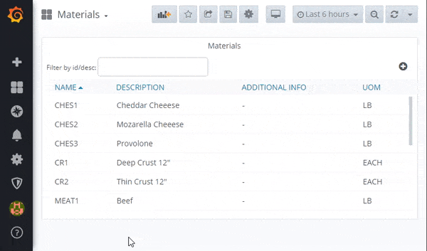
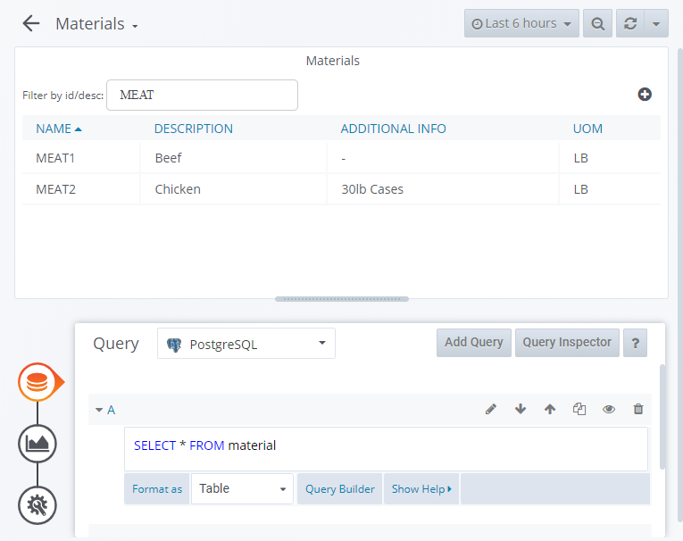

# Libre Material CRUD Table Panel

> Libre Grafana panel for Create, Read, Update and Delete of Materials

This panel gives users the ability to search for, create, read, update and delete materials as part of [Libre](https://github.com/Spruik/Libre). Materials are the ingredients that are applied during operations to make a product. This plugin interfaces to a no security json rest api for materials running on the same grafana server. This panel is targeted at Grafana v6.x.x only.

Material objects have four properties.

1. name - Name of the material _required, limited to 20 characters_
2. description - Description of the product _required, limited to 50 characters_
3. description_optional - Optional description of the packaging type _limited to 50 characters_
4. unit_of_measure - U.O.M. _limited to 10 characters_



## Installation

The easiest way to get started with this plugin is to [download the latest release](https://github.com/Spruik/Libre-Material-CRUD-Table-Panel/releases/latest/download/libre-material-crud-table-panel.zip), unzip into grafana plugin directory and restart grafana.

Download the latest release

```shell
$ wget https://github.com/Spruik/Libre-Material-CRUD-Table-Panel/releases/latest/download/libre-material-crud-table-panel.zip
Resolving github.com (github.com)... 140.82.114.4
...
2020-06-24 20:47:59 (1.08 MB/s) - 'libre-material-crud-table-panel.zip' saved [90150]
```

Unzip into your Grafana plugin directory

```shell
$ unzip libre-material-crud-table-panel.zip -d /var/lib/grafana/plugins
Archive: libre-material-crud-table-panel.zip
...
inflating: /var/lib/grafana/libre-material-crud-table-panel/utils.js.map
```

Restart Grafana

```shell
$ service grafana-server restart
 * Stopping Grafana Server
 * Starting Grafana Server
```

## Usage

In order to get the most out of this panel:

1. Add a *Table* metric to query materials. For example `SELECT * FROM material`. This panel expects an id, name and sequence column.



2. Apply custom column styles:

| Column               | Type   | Name Override | Other |
|----------------------|--------|---------------|-------|
| id                   | hidden |       -       |   -   |
| name                 | String | ID            |   -   |
| description          | String | Description   |   -   |
| description_optional | String | Description 2 |   -   |
| unit_of_measure      | String | UOM           |   -   |

### Adding

Use the + icon to add in a new material by providing a name and a sequence.

### Update / Delete

Click an existing material so show the actions popup. Delete removes the object, whilst update shows a popup to edit and save an material properties.

### Searching

Use the search box to filter the list of materials.

## Developing

### Getting Started

A docker-compose and grunt script is provided in order to quickly evaluate source code changes. This requires

Prerequisites

- docker (>= 18 required)
- docker-compose (>= 1.25 required)
- node (>= 12 required)
- npm (>= 6 required)

Start by cloning this repository

```shell
~/
$ git clone https://github.com/Spruik/Libre-Material-CRUD-Table-Panel
Cloning into 'Libre-Material-CRUD-Table-Panel'...
remote: Enumerating objects: 185, done.
remote: Counting objects: 100% (185/185), done.
remote: Compressing objects: 100% (115/115), done.

Receiving objects: 100% (185/185), 1.03 MiB | 10.14 MiB/s, done.
Resolving deltas: 100% (102/102), done.

```

Enter project and install dependencies

```shell
$ cd ./Libre-Material-CRUD-Table-Panel
~/Libre-Material-CRUD-Table-Panel
$ npm install
...
added 624 packages in 12.022s
```

Install Grunt globally

```shell
$ npm install grunt -g
C:\Users\user\AppData\Roaming\npm\grunt -> C:\Users\user\AppData\Roaming\npm\node_modules\grunt\bin\grunt
+ grunt@1.1.0
updated 1 package in 1.364s
```

Run grunt to build the panel

```shell
$ grunt
Running "copy:src_to_dist" (copy) task
Created 3 directories, copied 9 files

Running "copy:readme" (copy) task
Created 1 directory, copied 9 files

Running "string-replace:dist" (string-replace) task

1 files created

Running "copy:pluginDef" (copy) task
Copied 1 file

Running "babel:dist" (babel) task

Done.

```

Start docker-compose.dev.yml detached

```shell
~/Libre-Material-CRUD-Table-Panel
$ docker-compose -f docker-compose.dev.yml up -d
Creating network "libre-material-crud-table-panel_default" with the default driver
Creating libre-material-crud-table-panel_postgres_1 ... done
Creating libre-material-crud-table-panel_postrest_1 ... done
Creating libre-material-crud-table-panel_simulator_1 ... done
Creating libre-material-crud-table-panel_grafana_1   ... done

```

Run grunt watch to recompile on change

```shell
~/Libre-Material-CRUD-Table-Panel
$ grunt watch
Running "watch" task
Waiting...
```

Open your favourite editor and start editing ./src files. The grunt watch task will detect this and recompile the panel. Use your favourite web browser and point to http://localhost:3000 login and create a dashboard with this panel. Your browser will need to be refreshed to reflect your changes to this panel, ensure your browser isn't caching files.

### Building

Prerequisites

- node (>= 12 required)
- npm (>= 6 required)

Build panel and zip into archive

```shell
~/Libre-Material-CRUD-Table-Panel
$ grunt build
Running "clean:0" (clean) task
>> 1 path cleaned.

Running "clean:1" (clean) task
>> 1 path cleaned.

Running "clean:2" (clean) task
>> 1 path cleaned.

Running "copy:src_to_dist" (copy) task
Created 3 directories, copied 9 files

Running "copy:readme" (copy) task
Created 1 directory, copied 9 files

Running "string-replace:dist" (string-replace) task

1 files created

Running "copy:pluginDef" (copy) task
Copied 1 file

Running "babel:dist" (babel) task

Running "compress:main" (compress) task
>> Compressed 45 files.

Running "compress:tar" (compress) task
>> Compressed 45 files.

Done.

```

Find a completed build of this panel in the root directory named `libre-material-crud-table-panel.zip`.

## Contributing

For any issue, there are fundamentally three ways an individual can contribute:

- By opening the issue for discussion: For instance, if you believe that you have uncovered a bug in, creating a new issue in the [GitHub issue tracker](https://github.com/Spruik/Libre-Material-CRUD-Table-Panel/issues) is the way to report it.
- By helping to triage the issue: This can be done either by providing supporting details (a test case that demonstrates a bug), or providing suggestions on how to address the issue.
- By helping to resolve the issue: Typically, this is done either in the form of demonstrating that the issue reported is not a problem after all, or more often, by opening a Pull Request that changes some bit of something in the panel in a concrete and reviewable manner.

## Change log

- 1.0.2 Add tar build output
  - Remove unused libraries
  - Fix npm audit
  - Add tar build output
  - Update README shell output
  - Bump Revision

- 1.0.1 Update Documentation
  - Remove unused grunt config
  - Fix shell outputs and subtitle
  - Expose simmulator port

- 1.0.0 Initial Public Release
